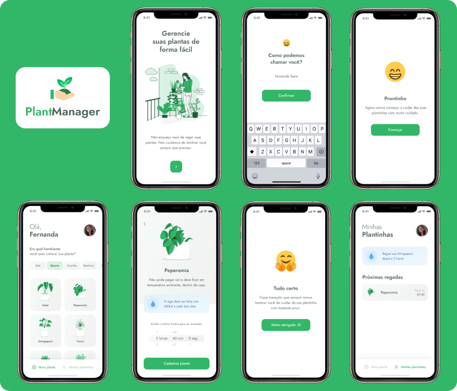

<h1 align="center">
   
</h1>

<p align="center">
   <a href="#-Projeto">Projeto</a>&nbsp;&nbsp; | &nbsp;&nbsp;
   <a href="#-Sobre">Sobre</a>&nbsp;&nbsp; | &nbsp;&nbsp;
   <a href="#-Tecnologias">Tecnologias</a>&nbsp;&nbsp; | &nbsp;&nbsp;
   <a href="#-Layout">Layout</a>&nbsp;&nbsp; | &nbsp;&nbsp;
   <a href="#-Prática">Prática</a> &nbsp;&nbsp; | &nbsp;&nbsp;
   <a href="#-License">License</a>
</p>

<br>

<p align="center">
  
</p>

<br>

## 🌱Projeto
---
Criação de um aplicativo para auxiliar o usuário sobre quais plantas ele possui e quando deverá regar cada uma. 

## 🔖 Sobre
---
Este projeto foi desenvolvido durante a NLW#5 (Abril 19-25, 2021), feita pela [rocketseat](https://rocketseat.com.br/).

Aprendemos, do zero, como fazer um aplicativo sem que fosse necessário a utilização de uma API externa, fazendo nossa própria API.

Foi a primeira vez que tive contato com a biblioteca do React Native, e também com Typescript. A experiência e o aprendizado foi sensacional. 

## 🚀 Tecnologias
--- 
Tecnologias utilizadas durante o projeto:

- [React Native](https://reactnative.dev/docs/getting-started)
- [Expo](https://expo.io/)
- [TypeScript](https://www.typescriptlang.org/)

## 🎨 Layout
---
Para visualizar o design do projeto entre na sua conta do Figma e copie o layout: [Layout PlantManager](https://www.notion.so/Aula-01-d0fd1057fdbe4ea89f392978995a0347#e9dd253ad90147da825aa4eeef34ab0d).

## 👩‍💻 Prática
---
Clonar o projeto:
```bash
$ git clone https://github.com/FernandNsp/nlw-5-reactNative.git
````

Instalações necessárias:
```bash
# Instalar Yarn
$ yarn install

# Iniciar o projeto
$ expo start

# Iniciar a fake api
json-server ./src/services server.json --host endereco.de.ip --port 3333 --delay 700
```

## 📄 License
---
Esse projeto está sob a licença MIT. Para mais detalhes acesse o arquivo [LICENSE](https://github.com/FernandNsp/nlw-5-reactNative/blob/main/LICENSE).
